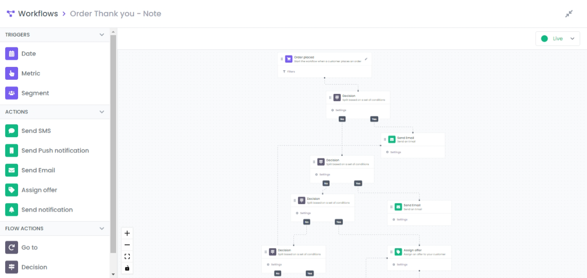

One of the most important features on LoyaltyDish is the workflows system.

A workflow is a sequence of automated actions, which can include email and SMS messages, that is triggered due to various reasons:

- When a customer performs an action like placing an order or redeeming an offer.
- When a customer is included in a segment, which is a dynamic grouping of profiles that meet certain criteria.
- When a  a specific date-based profile property is set (customer birthday, offer start/end, etc…).

For example, a welcome series workflow is triggered when someone signs up to our platform. After triggering the flow, they can be sent a welcome email followed multiple pre-configured messages over time that introduces them to our brand. Workflows can include time delays between actions, decision making and multiple paths that split based on different criteria for further customization.

We will then walk through setting your first workflow live by:

- Choosing a trigger for your flow and setting up the filters
- Adding steps to a flow
- Connecting steps in a flow

## Choosing a trigger for your flow and setting up the filters

When selecting a trigger for your workflow, you have to choose one of three options outlined below: **Metric**, **Segment**, **Date**.

You select the trigger type by dragging and dropping it in the workspace.

### Metric

To change the event, click on the pen tool on the right, a list of available events will popup.

### Segment

By clicking on **Filters** button, a segmentation editor will popup. Refer to [Segmentation editor](https://www.notion.so/LoyaltyDish-97a8334216a94c31971b453235c5980a) for a user guide.

By clicking on **Settings** button, a settings for will pop up, it allows to schedule the task by choosing a specific date or a crontab expression.

### Date

To filters on the targeted object, click the **Filters** button. in this example the targeted object is a loyalty that allows to redeem points to a specific product.

## Adding steps to a flow

After you select a trigger and add any desired filters, you're ready to add additional components into your workflow.

Flow components come in 3 types:

1. **Action:** an action component performs a specific task such as sending out a message or assigning an offer.
2. **Flow action:** can be used to branch your flow into multiple paths based on information related to the event that triggered the flow or add time delays between actions.

## Connecting steps in a flow

In order to connect components, you should drag from the source’s connection point and drop on the target.

