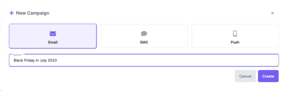
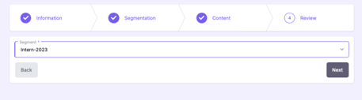
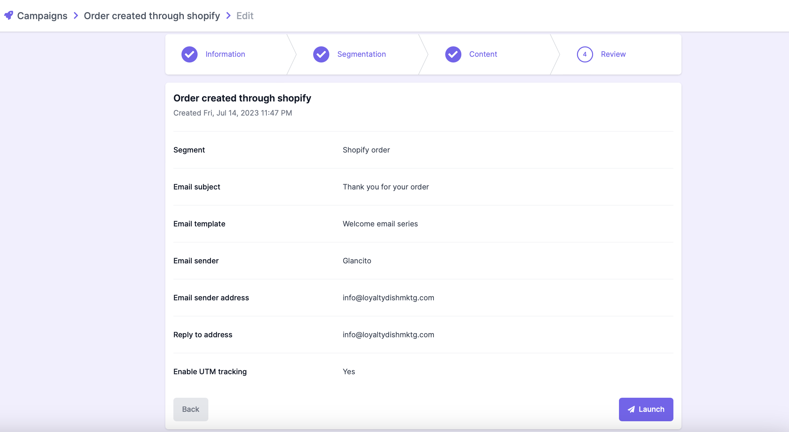

# Create a new Campaign:

To create a new Campaign, follow these steps:

1.	Open Glancito and click on the Campaign icon on the left menu. Then go to the Create Campaign
2.	Chose the Campaign Type (Email or SMS or Push)
3.	Assign a campaign name: Give your campaign a unique and descriptive name. This will help you easily identify and manage it in the future. Ex: Black Friday in July 2023

      

4.	Click Create button will create a new Campaign and open up the next Page
5.	Choose a segment: Select the target audience segment for your campaign. This could be based on demographics, past behavior, or any other relevant criteria. Choosing the right segment ensures your message reaches the intended recipients. Please click here to understand how to create Segments
      
            

6.	In the next screen, we have an option to chose the email templates, offers and details 
      a. Choose an Offer: Select the offer you want to include in your campaign. This could be a discount, promotion, or any other compelling incentive.
      b. Choose a subject: Write a captivating subject line that entices recipients to open your email. Make it concise, engaging, and relevant to the content of your campaign.
      c. Email sender & sender address: Determine the name and email address of the sender that will appear in the recipient's inbox. Use your company name or a specific person within your organization to ensure recognition and trustworthiness.
      d. Enable UTM tracking: Decide whether to enable UTM tracking. UTM parameters are tags added to URLs that allow you to track the performance of your campaign in analytics tools. Enable this feature if you want detailed insights into campaign engagement and conversions.
      
7. Schedule the campaign: Set a specific date and time for sending the campaign. Choose a timing that aligns with your marketing strategy, considering factors like time zones and the optimal timing for your target audience.

   

Once you've completed these steps, thoroughly review your campaign settings and content to ensure accuracy and alignment with your goals. Verify all the details before proceeding to activate or schedule the campaign within your marketing automation tool.

Congratulations! You have successfully created your first campaign. It's an exciting milestone in your marketing journey. Now, it's time to launch your campaign and start engaging with your target audience. Keep a close eye on the campaign's performance and make necessary adjustments along the way. Remember to analyze the results, gather valuable insights, and use them to improve future campaigns. 
