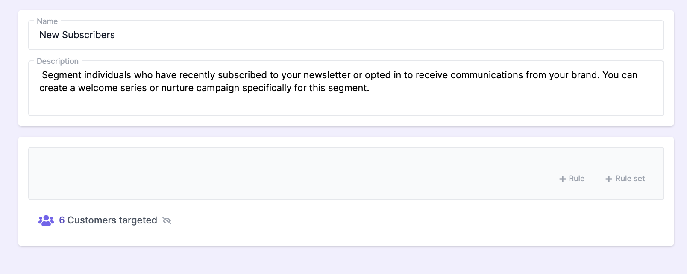
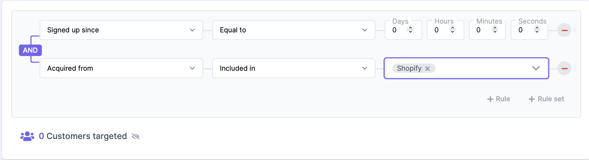

# Unlocking Marketing Potential: The Power of Segmentation

**What's Segment?**

A segment refers to a distinct group or subset of individuals within a larger audience who share common characteristics or behaviors. Segmentation is a fundamental concept that allows marketers to divide their audience into these segments for targeted and personalized marketing strategies.

Segments can be defined based on various factors, including demographics (such as age, gender, location), psychographics (such as interests, lifestyle), purchase history, engagement level, or any other relevant data points. By creating segments, marketers can tailor their messaging, offers, and campaigns to address the unique needs and interests of each segment, thereby increasing the effectiveness of their marketing efforts.

Creating a Segment based **new subscribers** through Shopify

1. Open Glancito console
2. Navigate to Segments
3. Select  ***New Segment***, name your segment and description
     <!-- Add an empty line -->   
   
     <!-- Add an empty line -->  
4. With the segment builder, add this rules

    * Who signed up since and choose a date and timestamp range
    * Acquired from included in Shopify only
        <!-- Add an empty line -->  
    
        <!-- Add an empty line -->  
5. Click Create 

Now, you have successfully created a segment specifically for new subscribers through Shopify. This segment will enable you to target and engage with this audience separately, allowing for personalized marketing campaigns and tailored communication. 
