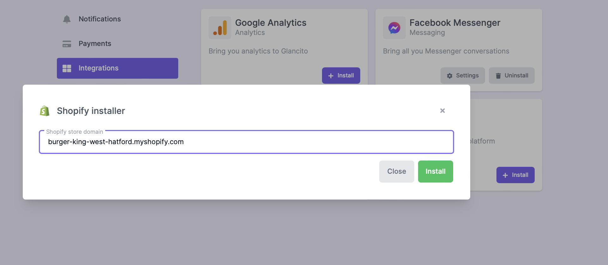

# How to Integrate with Shopify

To add the Shopify integration to Glancito, follow these steps:

1.	Login to Glancito and click on the bottom-left Setting’s menu icon. Then go to the Integration Tab.
        <!-- Add an empty line -->  
      
      
        <!-- Add an empty line -->  
      

2.	Look for the Shopify integration and click on the Install icon next to it. This will prompt to enter your shopify store name. Ex: mystore.myshopify.com
      If prompted, log into your Shopify account.

        <!-- Add an empty line -->  

      
        <!-- Add an empty line -->  
      
3.	Once you're redirected to Shopify, review the permissions requested by Glancito. If everything looks good, click on the Install app button.

        <!-- Add an empty line -->  

      
        <!-- Add an empty line -->  

4.	After installing the app, you'll be automatically added to the Free Plan. Glancito will start syncing the following Shopify data in the background:
      a.	Store master data
      b.	Product master data, including variants
      c.	Customer data like Name, Address, marketing consent, etc..,
      d.	Order related data

With the Shopify integration successfully installed, Glancito will continually synchronize the specified data, ensuring you have the most up-to-date information in your Glancito account.

