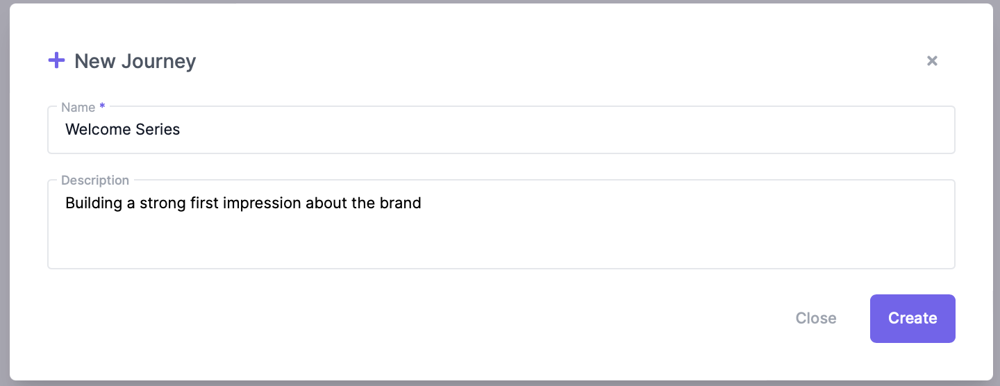
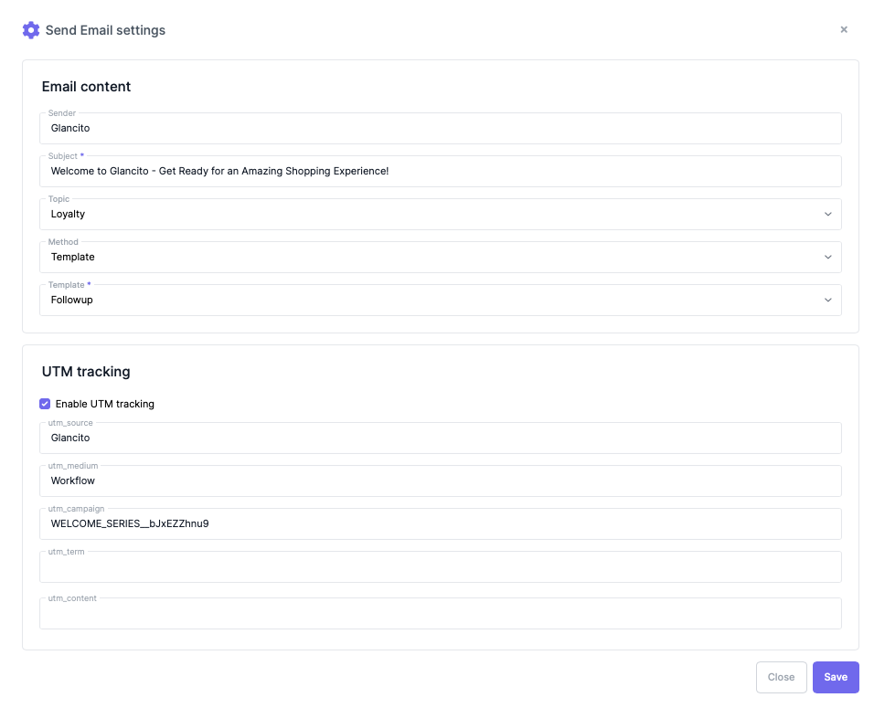
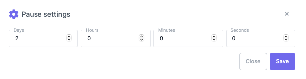
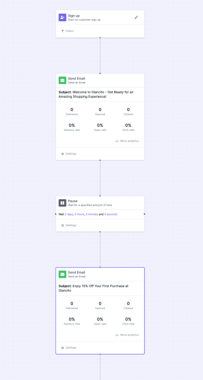

# Journey

**What's Journey builder?**

A journey builder is an interface provided by Glancito to design, create, and automate customer journeys or workflows. It allows marketers to map out the entire customer journey, from the initial touchpoint to desired outcomes, and define the sequence of steps and actions that guide customers through that journey.

The Glancito's Journey consists of the following elements:

* **Triggers:** These are the events or actions that initiate the customer journey. Triggers can include actions such as form submissions, email opens, website visits, or specific dates.
    <!-- Add an empty line -->  
* **Actions:** These are the specific actions or tasks that the system performs in response to a trigger. Actions can include sending emails, updating contact information, adding or removing from a segment, assigning tasks, or updating CRM records.
    <!-- Add an empty line -->  
* **Conditions:** Conditions are used to apply filters or rules that determine the path or flow within the journey. They allow for personalization and segmentation based on various criteria such as demographics, behaviors, or past interactions.
    <!-- Add an empty line -->  
* **Pause (Wait Steps):** Wait steps introduce time delays within the journey. They allow marketers to specify how long a contact should wait before proceeding to the next step. This can be useful for timing follow-up messages or nurturing sequences.
    <!-- Add an empty line -->  
* **Branches and Decisions:** These elements allow for branching paths within the journey based on specific conditions or customer behaviors. This enables marketers to create personalized experiences tailored to different customer segments or responses.
    <!-- Add an empty line -->  
**Goals or Outcomes: Goals define the desired outcomes of the customer journey. They represent the ultimate objectives, such as making a purchase, completing a form, or achieving a specific engagement milestone.

Creating a **Welcome Series** Journey based new subscribers/signups 

1. Open Glancito console
2. Navigate to Journey
3. Select  ***New Journey***, name your Journet, add description and click create 
     <!-- Add an empty line -->   
   
     <!-- Add an empty line -->  
4. Now select the **Welcome Series** Journey from the list and start building your welcome series with below objective
     <!-- Add an empty line -->  
    A Welcome Series refers to a sequence of targeted communications or interactions that are specifically designed to engage and onboard new customers when they first interact with a brand. It is an automated series of messages that are triggered after a user takes a certain action, such as subscribing to a newsletter, signing up for a service, or making their first purchase.
     <!-- Add an empty line -->  
    * Email #1: Send immediately welcome and Introduction of your brand
    * Email #2: after 2 days Exclusive Discount
    * Email #3: after 5 days  about Customer Testimonials
    * Email #4: after 7 days about Helpful Tips ad Guides
        <!-- Add an empty line -->  

5. Please follow the steps below
   
    * Drag and drop the **Metrics** element from the triggers section. Select the **Sign up** metric to idenify the trigger for your welcome series
    * Drag and drop the *Send Email* action into the editor. Chose the sender Name, Email subject, email template and enable UTM if required to track Google Analytics
        <!-- Add an empty line -->  
    
        <!-- Add an empty line -->  
    * To introduce a 2-day wait between emails, drag and drop the "Pause" flow action. Enter the number of days you want to wait before sending the next email in the series.
        <!-- Add an empty line -->  
      
        <!-- Add an empty line -->  
    * Repeat the same steps for the remaining emails in the welcome series, customizing the content, timing, and any additional actions.

By following these steps, you can create a welcome email series that triggers based on the sign-up metric, sends personalized emails with the desired sender name, subject, and template. It also includes pauses to control the timing between emails.
  <!-- Add an empty line -->  
   
