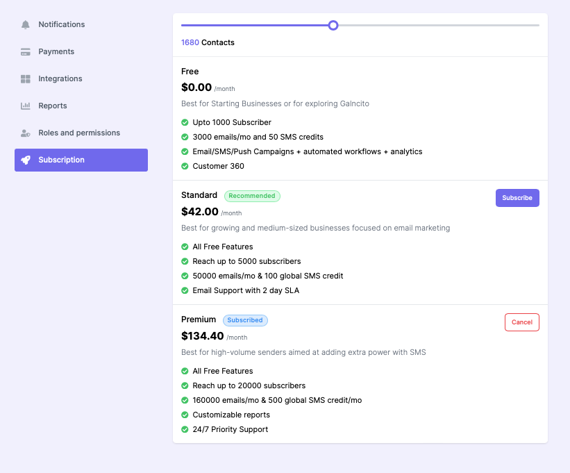
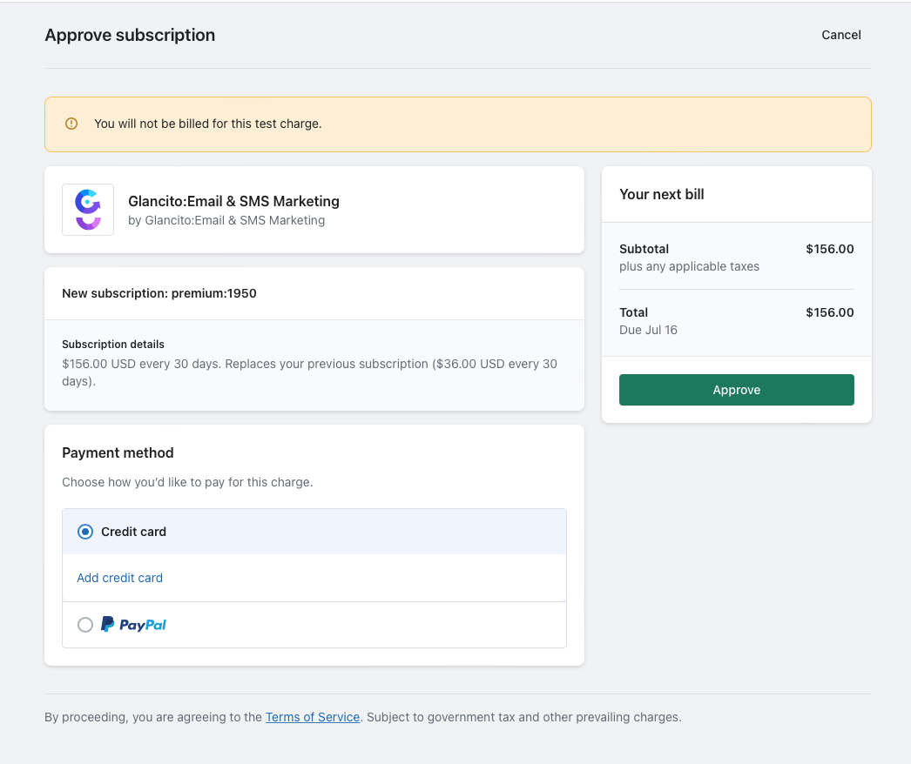

# Subscription

The Glancito Subscription model offers a unique benefit: the ability to pay less initially and increase your subscription as your business grows.

With Glancito's Subscription model, you have the flexibility to start with a lower subscription tier that aligns with your current needs and budget. As your business expands and your requirements evolve, you can easily scale up your subscription to accommodate your growing demands.

This model provides a cost-effective solution, allowing you to allocate resources efficiently without overcommitting to a higher-priced plan from the beginning. It enables you to optimize your spending and ensure that you pay for the features and capabilities you require at each stage of your business growth.

By subscribing to Glancito's scalable model, you can seamlessly adjust your subscription as your business flourishes, ensuring that you have the necessary tools and resources to support your expanding operations. It empowers you to effectively manage your subscription costs while maintaining a competitive edge in your industry.

  <!-- Add an empty line -->  

**How to change subscription?**

Upon signing up, you will be automatically enrolled in the Free Plan by default. As you begin using the service and reach the subscriber or email count limit associated with the Free Plan, an email notification will be sent to remind you to consider upgrading your subscription based on your future needs.
  <!-- Add an empty line -->  
This proactive approach ensures that you are aware of your usage and helps you make informed decisions about upgrading to a plan that better suits your growing requirements. The email reminder serves as a helpful prompt, notifying you when it may be beneficial to explore the available subscription options and unlock additional features or capacity.
  <!-- Add an empty line -->  

Follow these steps to manage your subscription in Glancito:

1. Open Glancito and click on the bottom-left Settings menu icon. Then, navigate to the Subscription Tab.
2. Adjust the number of customer profiles or select a plan that aligns with your specific needs. Choose the subscription plan that offers the features and capacity required for your business.
3. If necessary, you may be prompted to log in to your Shopify admin console. This step ensures a seamless integration and allows Glancito to access the relevant subscription information.
4. On the Subscription page, you will find details about the new subscription premium for the desired number of contacts. Additionally, you'll have the option to select your preferred payment method.
     <!-- Add an empty line -->  
    
     <!-- Add an empty line -->  

5. Once you have reviewed the information and made your selection, click on "Approve" to update and confirm your subscription. Glancito will process the changes, and you will be redirected back to the Glancito subscription page. 

By following these steps, you can easily manage your Glancito subscription, customize it based on your needs, and ensure a smooth and uninterrupted experience with the platform.

