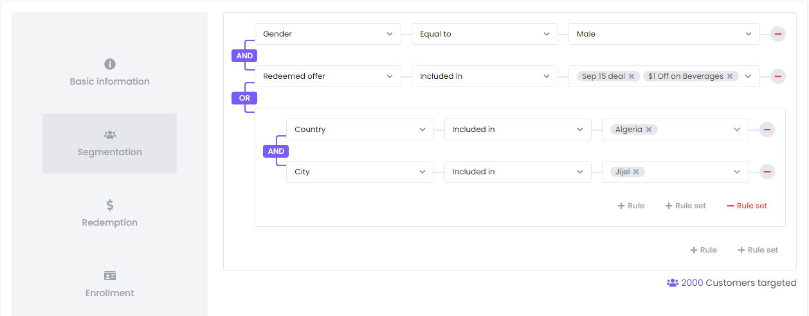

# LoyaltyDish Segmentation Editor



Upon creating an offer for your customers on LoyaltyDish, you often want this offer to appear to just a portion of those customers that meet certain criteria and not all of them. Our segmentation editor helps you achieve that by providing a UI to chain filters based on customer properties and behavior with logical operators (AND, OR).

## Segmentation editor GraphQL API

The segmentation filters chain in Loyaltydish’s codebase is represented in a form of nested arrays:

```json
[["gender", "exact", "MALE"], "AND", ["redemptions__offer", "in", ["194", "60"]]]
```

In order to retrieve the list customers that fulfill these conditions, use the `consumers` query:

=== "Request"
    ```graphql
    query ($segmentationRules: JSONString) {
      consumers(segmentationRules: $segmentationRules) {
        count
        edges {
          node {
            firstname
            lastname
          }
        }
      }
    }
    ```

=== "Variables"
    ```json
    {
      "segmentationRules": "[[\"gender\",\"exact\",\"MALE\"],\"AND\",[\"redemptions__offer\",\"in\",[\"194\",\"60\"]]]"
    }
    ```
